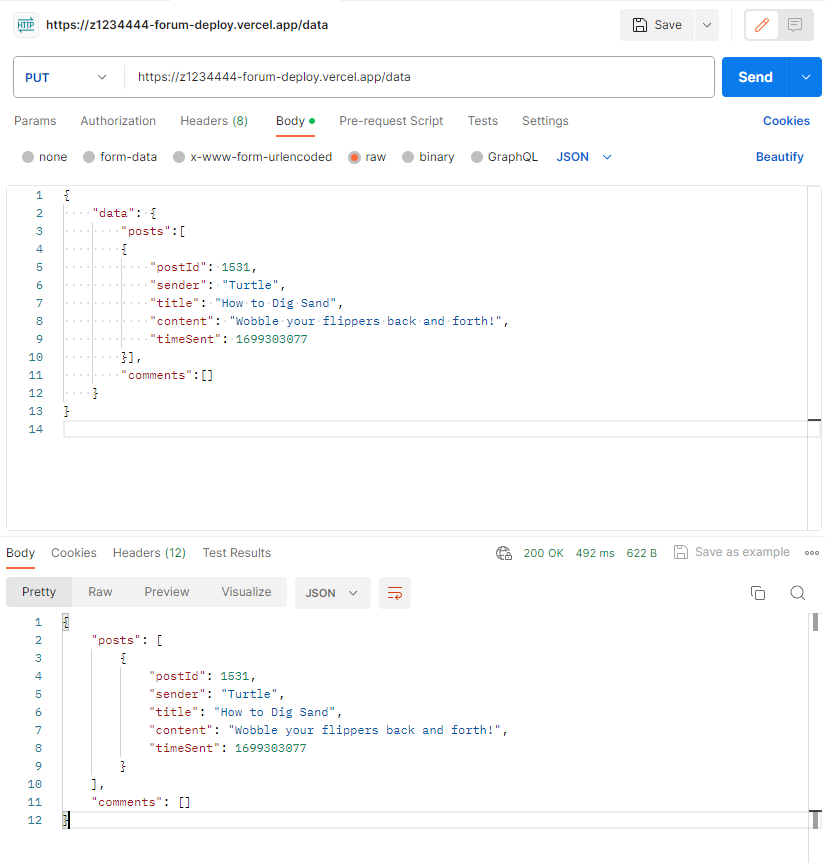

# Lab09 Deploy

[TOC]

# Due Date

Week 10 Tuesday 5:00pm [Sydney Local Time](https://www.timeanddate.com/worldclock/australia/sydney).

# Note

1. We'll be using a new [`lab09_forum`](https://cgi.cse.unsw.edu.au/~cs1531/redirect/?path=COMP1531/23T3/students/_/lab09_forum) repository to demonstrate deployment. This is simply a stripped down solution for `lab05_forum` that allows us to assess a very basic implementation of the following routes:
    - root (`/`), 
    - echo (`/echo/echo`), 
    - post create (`/post/create`), 
    - posts list (`/posts/list`), and 
    - clear (`/clear`)

2. Although it is not a requirement that you deploy to Vercel in this lab, we recommend doing so as you will receive the most support from our staff this way.

3. Please read the lab instructions regarding the [submission process](#testing-and-submitting-your-deployed_url) carefully. While most of the work is done in lab09_forum, **you will still need to clone lab09_deploy to modify and submit the [src/deploy.ts](src/deploy.ts) file!**

# Background

## Rationale

Deploy deploy deploy 🚀!

While having our forum application working locally is fun and all, there's no point if you can't show it off to everyone else 😎!

In this lab, you will expose your backend server application to the outside world via serverless functions and using databases. You can use it to chat with your friends, host secret parties or plot a coup d'etat against COMP1531 staff - the possibilities are endless!

## Getting Started

- Copy the SSH clone link from Gitlab and clone this repository on either VLAB or your local machine.
- In your terminal, change your directory (using the cd command) into the newly cloned lab.

## Package Installation

1. Open [package.json](package.json) and look at existing packages in "dependencies" and "devDependencies". Install them with:
    ```shell
    $ npm install
    ```

1. Use `git` to `add`, `commit` and `push` your [package.json](package.json) and [package-lock.json](package-lock.json).

1. That's it :). This repository (`lab09_deploy`) is **only for submitting your `DEPLOYED_URL` and sanity-checking with the given tests and pipeline**. Most of the work (i.e. the deployment process) **should be done in your `lab09_forum` repository**.

# Task 

An image guide is available for some of the instructions below. You can toggle their visibility by clicking on the respective text - for example:

<details close>
<summary>Click this line of text to toggle image visibility</summary>


</details>

Make sure to also read the tips given by Vercel as you progress through the lab. **Don't just blindly follow the instructions given**, as there will be inputs that you will need to modify accordingly for your needs.

## 0. Create Accounts
1. **A private github account:** Vercel requires you to link your backend repository in order to deploy it. If you do not currently have an account, you should create one by following the link: https://github.com/signup

2. **A Vercel account:** Vercel offers us a serverless method to deploy our backend repository. The setup is completely free and does not require any payment methods for sign up. Create an account and select **Continue with GitHub** so that your accounts can be linked: https://vercel.com/signup.

## 1. Duplicate your repository to GitHub

1. Clone your `lab09_forum` repository onto your machine. 
1. Open your terminal and navigate to the `lab09_forum` folder.
2. Create a new branch to represent the deployed version of your server, e.g. `deploy_forum`.
3. In a seperate window, log in to your GitHub account and select **New repository**. 
    <details close>
    <summary>Top Left > Dropdown > New Repository</summary>

    

    </details>

4. Name your repository, e.g. "`Forum-Deploy`", and make sure to select **Private**. Then hit **Create Repository**.
    <details close>
    <summary>Create Repository Form - example details</summary>

    

    </details>

5. You should be automatically navigated to your created repository. Back on your terminal, use the following code to update your GitHub repository.
```shell
# Replace <SSH_URL> with your Github repository's SSH URL
# E.g. git@github.com:USERNAME/Forum-Deploy.git
$ git remote add deploy <SSH_URL>
$ git push deploy
```
After running the command, your GitHub repository should then be populated with the code from your backend.

**NOTE**: To update your Github repository, run `git push deploy` after changes have been committed.

## 2. Deploy Server using Vercel
*[Vercel](https://en.wikipedia.org/wiki/Vercel) is a cloud platform as a service company. Vercel architecture is built around [composability](https://en.wikipedia.org/wiki/Composability).*

1. In your lab repo, install the [vercel](https://www.npmjs.com/package/vercel) package
    ```shell
    $ npm install vercel
    ```

2. In the root directory, create a file called `vercel.json` and copy the following content into the file. This esentially configures our vercel deployment to redirect all routes to the `server.ts` file.
    ```json
    {
      "version": 2,
      "builds": [
          {
              "src": "src/server.ts",
              "use": "@vercel/node"
          }
      ],
      "routes": [
          {
            "src": "/(.*)",
            "dest": "src/server.ts"
          }
      ]
    }
    ```

3. Add and commit all changes and push them up to the repository: 
    ```shell
    $ git push deploy
    ```
4. On the Vercel homepage, log into Vercel and then select the `Add New...` button and `Project` selection.
    <details close>
    <summary>Top Left > Add New > Dropdown > Project </summary>

    

    </details>

5. Select `Import` on your repository that you created in GitHub.
    <details close>
    <summary>Select Github Provider </summary>

    

    </details>
    <details close>
    <summary>Import Git Repository > Import </summary>

    

    </details>

    Can't see your github repo? Follow the `Adjust GitHub App Permissions →` link and instructions.

6. Select `Deploy` to deploy your repository and wait shortly for your repository to be built.
    <details close>
    <summary> Configure Project > Deploy </summary>

    

    </details>

    If successful, you should see a "Congratulations" and on your `Dashboard` see your deployment with a green "Ready" Status. 
    <details close>
    <summary> Successful Deployment View </summary>

    

    </details>

7. Make your deployed url contain your zID. Go to `Project Settings` > `Domains` > `Edit`, and modify your domain name to include your zid, e.g. `z1234444-forum-deploy.vercel.app` .
    <details close>
    <summary> Homepage > Project Menu > Settings </summary>

    

    </details>
    <details close>
    <summary> Project Settings > Domain > Edit </summary>

    

    </details>

8. Congratulations! You've now deployed your server onto the web...somewhat. If you (or a friend) visits the root (`/`) or echo (`/echo/echo?message=hello`) routes on your deployed url, your deployed server should respond with the resulting response from your backend - awesome! 

    BUT, as soon as you try to access other routes that manipulate your data store, you'll start running into server errors.

    <details close>
    <summary> Failed DELETE '/clear' request using API Client  </summary>

    

    </details>

    Why is this the case? Well Vercel is a [serverless](https://vercel.com/docs/functions/serverless-functions) deployment option that will only respond when a request is made. Any state variables, including local files e.g. `database.json`, will not be preserved. This means that if we'd implemented persistence - we'd lose it! What's a more robust solution? Instead of reading and writing to a file in our folder, let's read and write our data from an online database.

## 3. Set up a Database
1. On your deployment page, navigate to the `Storage` tab.
    <details close>
    <summary>Top Bar > Storage </summary>

    

    </details>

2. Select `Create New Database` and select the `KV` option. You can use any database name, e.g. `Forum Database`, but make sure the `Primary Region` is `Washington, D.C., USA iad1`. **DO NOT SELECT PRIMARY REGION AS SYDNEY** as this will lead to longer round trip times for network requests between your deployement and your databse. 
    <details close>
    <summary>Create KV Database Form - example details </summary>

    

    </details>

3. Afterwards select `Create` and navigate to the database.
4. Navigate to the "`.env.local`" tab. Select show secret and copy the `KV_REST_API_URL` and `KV_REST_API_TOKEN`.
    <details close>
    <summary> All Databases >  KV Database > .env.local </summary>

    

    </details>

5. Back on your terminal, install [@vercel/kv](https://www.npmjs.com/package/@vercel/kv) 
    ```shell
    $ npm install @vercel/kv
    ```
6. Copy and declare the `KV_REST_API_URL` and `KV_REST_API_TOKEN` as const variables in the `server.ts` file. You can see them by clicking on the `Show Secret` button. Copy the following code snippet into `server.ts` to open a client so that we can request to read or write to our database.
    ```typescript
    import { createClient } from '@vercel/kv';

    // Replace this with your API_URL
    // E.g. https://large-poodle-44208.kv.vercel-storage.com
    const KV_REST_API_URL="https://YOUR-URL.kv.vercel-storage.com";
    // Replace this with your API_TOKEN
    // E.g. AaywASQgOWE4MTVkN2UtODZh...
    const KV_REST_API_TOKEN="YOUR-API_TOKEN";

    const database = createClient({
      url: KV_REST_API_URL,
      token: KV_REST_API_TOKEN,
    });
    ```

## 4. Setup Deployed Database
1. Create two new routes to get and update your deployed database respectfully. These routes will serve as way to grab and update our online repository. An example code snippet can be found below:
    ```typescript
    app.get('/data', async (req: Request, res: Response) => {
      await database.hgetall('data:forum');
      res.status(200).json({});
    });

    app.put('/data', async (req: Request, res: Response) => {
      const { data } = req.body;
      await database.hset("data:forum", { data });
      return res.status(200).json(data);
    });
    ```
    And with that, we can now set and grab our data from an online database using Vercel KV. 
    
    Don't forget to add, commit, and push to deploy, to re-deploy your application on Vercel.
    
    Try testing this route by sending a PUT request via an api client.
    <details close>
    <summary> API Client PUT Request </summary>

    

    </details>

    And likewise, if you send a GET request you should be able to retrieve the data you just set.

    From here, when you need to `setData()` or `getData()` you should send a request to the server route with the data information you want. 

2. Modify the way we currently read and write data in our server to use these routes instead.

    An example implementation can be found below:

    ```typescript
    import request, { HttpVerb } from 'sync-request';

    // Replace this with your deployed URL
    // E.g. https://z1234444-forum-deploy.vercel.app/
    const DEPLOYED_URL = "https://YOUR-URL.vercel.app/"

    const requestHelper = (method: HttpVerb, path: string, payload: object) => {
      let json = {};
      let qs = {};
      if (['POST', 'DELETE'].includes(method)) {
      qs = payload;
      } else {
      json = payload;
      }

      const res = request(method, DEPLOYED_URL + path, { qs, json, timeout: 20000 });
      return JSON.parse(res.body.toString());
    };

    const getData = (): Data => {
    try {
      const res = requestHelper('GET', '/data', {});
      return res.data;
    } catch (e) {
      return {
        posts: [],
        comments: [],
      };
    }
    };

    export const setData = (newData: Data) => {
      requestHelper('PUT', '/data', { data: newData });
    };
    ```

    This is just one example, as students may have different keys or methods to save persistent data.

3. **Note**: For the deployed server you **MUST use the `sync-request`** and **NOT `sync-request-curl`**. Currently, the default Node environment Vercel uses to build projects does not include binaries which `sync-request-curl` relies on. 

    Make sure to install [sync-request](https://www.npmjs.com/package/sync-request),
    ```shell
    $ npm install sync-request
    ```

    and then utilise `sync-request` instead of `sync-request-curl` across your server. 
    ```typescript
    // Replace sync-request-curl for sync-request in your server
    // import request, { HttpVerb } from 'sync-request-curl';
    import request, { HttpVerb } from 'sync-request';
    ```

## Testing and Submitting your DEPLOYED_URL

To submit your deployed url, `cd` back into the `lab09_deploy` repository.

1. Open [src/deploy.ts](src/deploy.ts) and modify the `DEPLOYED_URL` to your newly deployed site, e.g. https://z1234444-anything-you-want.vercel.app. 
  
    **A reminder that the `DEPLOYED_URL` must contain your zID exactly once.** You may need to go to Settings > Domains > and edit your deployed url to include your zID.

2. Open [src/deploy.test.ts](src/deploy.test.ts) and uncomment the given tests. Ensure that the tests pass locally.

3. Push your code and the uncommented tests to your master branch. Your Gitlab pipeline should also pass.

4. As an optional final check, try connecting the [frontend](https://comp1531frontend.gitlab.io/forum) to your deployed backend application.


# Submission

- Please read the lab instructions regarding the [submission process](#testing-and-submitting-your-deployed_url) carefully.
- Use `git` to `add`, `commit`, and `push` your changes on your master branch.
- Check that your code has been uploaded to your Gitlab repository on this website (you may need to refresh the page).

**If you have pushed your latest changes to master on Gitlab no further action is required! At the due date and time, we automatically collect your work from what's on your master branch on Gitlab.**

Afterwards, assuming you are working on a CSE machine (e.g. via VLAB), we strongly recommend that you remove your `node_modules` directory with the command:
```shell
$ rm -rf node_modules
```
This is because CSE machines only allow each user to have a maximum of 2GB, so you will eventually run out of storage space. It is always possible to `npm install` your packages again!
